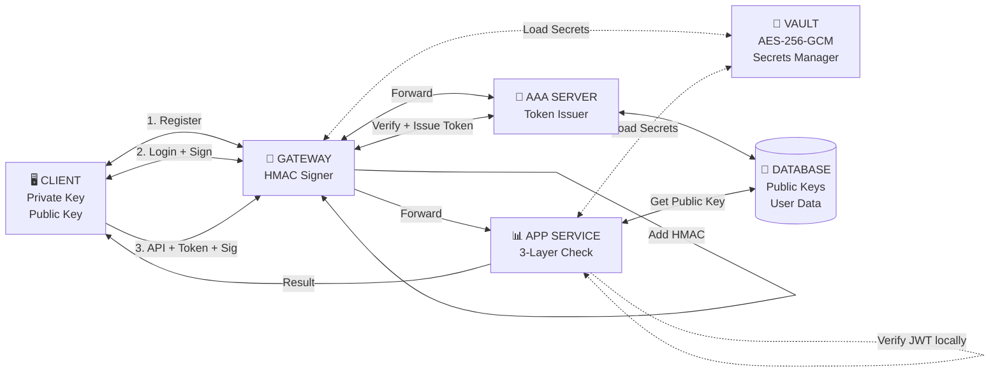

# BÁO CÁO & KỊCH BẢN DEMO: KIẾN TRÚC ZERO TRUST VỚI XÁC THỰC ĐA LỚP

## SƠ ĐỒ KIẾN TRÚC HỆ THỐNG

**Chi tiết từng luồng:**

1. **Register (Lần đầu):** Client → Gateway → AAA → Database (lưu Public Key)

2. **Login (Mỗi lần đăng nhập):**

   - Client ký vào {username, timestamp} bằng Private Key
   - Gateway forward đến AAA
   - AAA verify chữ ký + cấp JWT Token (chứa username, publicKey)

3. **API Call (Gọi hàm) - Zero Trust:**
   - Client gửi Token + Signature vào request body
   - Gateway load HMAC secret từ Vault
   - Gateway thêm HMAC vào request
   - Gateway forward đến App Service
   - **App Service xác thực 3 lớp (KHÔNG phụ thuộc AAA):**
     - Layer 1: Verify HMAC (Gateway authentication)
     - Layer 2: Verify JWT locally với secret từ Vault
     - Layer 3: Query Database để lấy Public Key → Verify Signature

## PHẦN 1: NỘI DUNG BÁO CÁO (THUYẾT TRÌNH)

### 1. Tổng quan vấn đề

- **Mô hình truyền thống (Perimeter Security):** Chỉ tập trung bảo vệ lớp vỏ bên ngoài (Firewall/Gateway). Khi tin tặc vượt qua được Gateway, chúng có quyền truy cập rộng rãi vào mạng nội bộ (Lateral Movement).
- **Lỗ hổng phổ biến:**
  - Phụ thuộc hoàn toàn vào Session Token (Cookies/JWT). Nếu Token bị lộ (XSS/MITM), kẻ tấn công có thể mạo danh người dùng.
  - Thiếu cơ chế chống chối bỏ (Non-repudiation).
  - Lộ thông tin qua kích thước gói tin (Traffic Analysis).

### 2. Giải pháp: Zero Trust Architecture

Dự án đề xuất mô hình **"Never Trust, Always Verify"** (Không tin bất kỳ ai, luôn luôn xác minh) với cơ chế xác thực 3 lớp tại Application Service.

#### Kiến trúc hệ thống

Hệ thống bao gồm 4 thành phần chính:

1.  **Client:** Giữ Private Key, thực hiện ký số ECDSA.
2.  **Gateway:** Điểm nhập (Entry point), thực hiện định tuyến và ký HMAC để bảo vệ đường truyền nội bộ.
3.  **AAA Server:** Quản lý định danh, khóa công khai (Public Key) và cấp phát Token.
4.  **App Service:** Thực hiện logic nghiệp vụ và xác thực 3 lớp.

### 3. Cơ chế bảo mật trọng yếu (Core Technologies)

#### A. Xác thực 3 Lớp (3-Layer Verification)

Mỗi Request đi vào App Service phải vượt qua 3 "cánh cửa":

- **Layer 1 - Gateway Integrity (HMAC):** Kiểm tra xem Request có thực sự đi qua Gateway chính thống hay không (Chống Bypass Gateway).
- **Layer 2 - Authorization (JWT Token):** Kiểm tra xem User có quyền gửi Request hay không (kiểm tra hạn dùng, issuer).
- **Layer 3 - User Identity (ECDSA Signature):** Kiểm tra xem người gửi có thực sự nắm giữ Private Key hay không (Cơ chế Holder-of-Key).

#### B. Holder-of-Key (Proof-of-Possession)

- Token chỉ là điều kiện **Cần**.
- Chữ ký số (tạo ra từ Private Key) là điều kiện **Đủ**.
- Nếu Hacker trộm được Token nhưng không có Private Key -> Request bị từ chối tại Layer 3.

#### C. Traffic Padding (Chống phân tích lưu lượng)

- Mọi gói tin (Login, Transfer, Balance) đều được độn (padding) thêm dữ liệu ngẫu nhiên để đạt kích thước cố định (ví dụ: 4KB).
- Mục đích: Che giấu hành vi người dùng khỏi các bộ phân tích mạng (Network Sniffers).

---

## PHẦN 2: KỊCH BẢN DEMO (LIVE DEMO SCRIPT)

**Môi trường:** Web UI Client kết nối tới hệ thống Backend (Gateway, AAA, App Service).

### Kịch bản 1: Luồng hoạt động bình thường (Happy Path)

- **Hành động:**
  1.  Nhấn **"Register New Account"** -> Tạo User mới (Hệ thống tự sinh cặp khóa ECDSA).
  2.  Nhấn **"Login"** -> Client dùng Private Key ký vào Timestamp để đăng nhập.
  3.  Thực hiện **"Check Balance"** hoặc **"Transfer Money"**.
- **Kết quả mong đợi:**
  - Giao diện hiển thị 3 đèn xanh: `Layer 1 (HMAC)`, `Layer 2 (Token)`, `Layer 3 (Signature)` đều **VERIFIED**.
  - Giao dịch thành công.
- **Giải thích:** Đây là trạng thái lý tưởng khi người dùng chính chủ thực hiện giao dịch qua kênh chính thống.

### Kịch bản 2: Tấn công giả mạo Token (Token Theft Attack)

- **Tình huống:** Hacker đã đánh cắp được JWT Token hợp lệ của người dùng qua đường truyền mạng, nhưng Hacker không có Private Key lưu trong máy người dùng.
- **Hành động (Trên Demo):**
  1.  Nhấn nút **"🔓 Token Theft Attack"**.
  2.  Hệ thống sẽ gửi Request kèm Token xịn, nhưng KHÔNG có chữ ký số (hoặc chữ ký sai).
- **Kết quả mong đợi:**
  - `Layer 1`: **Pass** (Qua Gateway).
  - `Layer 2`: **Pass** (Token hợp lệ).
  - `Layer 3`: **FAIL** (Thiếu chữ ký/Chữ ký không khớp).
  - Request bị chặn.
- **Giải thích:** Chứng minh cơ chế **Holder-of-Key**. Chỉ có Token là không đủ để truy cập hệ thống.

### Kịch bản 3: Tấn công trung gian thay đổi dữ liệu (MITM / Data Tampering)

- **Tình huống:** Hacker chặn Request chuyển tiền, sửa số tiền từ `10,000` thành `1,000,000` hoặc sửa người nhận tiền.
- **Hành động (Trên Demo):**
  1.  Nhấn nút **"✏️ Data Tampering Attack"**.
  2.  Client ký vào gói tin `amount: 10000`.
  3.  Giả lập Hacker sửa Payload thành `amount: 1000000` sau khi đã ký.
- **Kết quả mong đợi:**
  - `Layer 1`: **Pass**.
  - `Layer 2`: **Pass**.
  - `Layer 3`: **FAIL** (Chữ ký không khớp với dữ liệu đã bị sửa).
- **Giải thích:** Đảm bảo tính **Toàn vẹn dữ liệu (Integrity)**. Bất kỳ thay đổi nhỏ nào trên gói tin cũng làm mất hiệu lực của chữ ký số.

### Kịch bản 4: Tấn công phát lại (Replay Attack)

- **Tình huống:** Hacker bắt được một gói tin hợp lệ (đã ký đầy đủ) và gửi lại gói tin đó nhiều lần để spam hệ thống hoặc trừ tiền nhiều lần.
- **Hành động (Trên Demo):**
  1.  Nhấn nút **"🔁 Replay Attack"**.
  2.  Hệ thống gửi một Request hợp lệ nhưng với `timestamp` của 5 phút trước.
- **Kết quả mong đợi:**
  - Hệ thống báo lỗi: `Request timestamp expired`.
- **Giải thích:** Hệ thống backend chỉ chấp nhận các request trong khoảng thời gian (window) ngắn (ví dụ: 60 giây).

---

## PHẦN 3: CÂU HỎI & TRẢ LỜI PHẢN BIỆN (Q&A)

Dưới đây là các câu hỏi Hội đồng có thể đặt ra và gợi ý trả lời dựa trên mã nguồn dự án:

#### Câu 1: Tại sao phải xác thực lại ở App Service? Gateway đã xác thực rồi mà?

**Trả lời:**
Theo triết lý Zero Trust, chúng ta không tin tưởng mạng nội bộ.
Nếu chỉ xác thực ở Gateway (mô hình truyền thống), một khi Hacker chiếm quyền điều khiển Gateway hoặc một Service khác trong mạng nội bộ, hắn có thể gọi trực tiếp API của App Service để rút tiền.
Việc xác thực 3 lớp tại App Service đảm bảo rằng ngay cả khi Gateway bị "thủng", App Service vẫn tự bảo vệ được mình vì Hacker không thể giả mạo chữ ký của người dùng (Layer 3).

#### Câu 2: Việc ký số (ECDSA) trên mọi Request có làm chậm hệ thống không?

**Trả lời:**
Có ảnh hưởng đến hiệu năng nhưng ở mức chấp nhận được.

- **Về thuật toán:** Dự án sử dụng đường cong Elliptic (`secp256k1`), cho tốc độ ký và xác thực nhanh hơn nhiều so với RSA cùng độ mạnh bảo mật.
- **Về trải nghiệm:** Với các giao dịch tài chính quan trọng, độ trễ thêm vài mili-giây để đổi lấy tính an toàn và chống chối bỏ là sự đánh đổi xứng đáng.

#### Câu 3: Làm sao App Service biết Public Key của User để kiểm tra chữ ký?

**Trả lời:**
App Service áp dụng **Hybrid Approach** kết hợp JWT và Database:

1. **Layer 2**: App Service verify JWT **locally** (không gọi AAA) với secret từ Vault. JWT payload chứa `publicKey` ban đầu.

2. **Layer 3**: App Service query **Database trực tiếp** để lấy Public Key hiện tại của user (có caching 5 phút).

3. **Key Rotation Detection**: So sánh Public Key từ Database với Public Key trong JWT:
   - Nếu khác nhau → User đã rotate key → Reject request với message "Please login again"
   - Nếu giống nhau → Verify ECDSA signature

**Lợi ích**:

- Zero Trust: Không phụ thuộc AAA Server khi xử lý request
- Hỗ trợ key rotation và revocation
- Performance: Cache giảm DB queries

#### Câu 4: Padding dữ liệu lên 4KB để làm gì? Có tốn băng thông không?

**Trả lời:**

- **Mục đích:** Để chống lại kỹ thuật phân tích lưu lượng (Traffic Analysis). Nếu không padding, Hacker nhìn vào kích thước gói tin có thể đoán được hành động: gói tin nhỏ là "Check Balance", gói tin lớn là "Transfer". Khi tất cả đều là 4KB, Hacker không phân biệt được.
- **Băng thông:** Có tốn băng thông hơn, nhưng trong môi trường mạng hiện đại (4G/5G/Fiber), kích thước 4KB là rất nhỏ và không gây tắc nghẽn đáng kể.

#### Câu 5: Nếu mất Private Key thì sao?

**Trả lời:**
Trong mô hình này, Private Key gắn liền với thiết bị (lưu trong LocalStorage hoặc Secure Element của thiết bị). Nếu mất thiết bị hoặc xóa cache trình duyệt, User sẽ mất khả năng truy cập.
**Giải pháp thực tế:** Cần quy trình "Khôi phục tài khoản" (Account Recovery) - ví dụ: đăng ký lại Key mới sau khi xác minh danh tính qua eKYC hoặc OTP (Tuy nhiên, phần này nằm ngoài phạm vi demo hiện tại).

#### Câu 6: Layer 1 (Gateway HMAC) bảo vệ cái gì?

**Trả lời:**
Layer 1 đảm bảo rằng Request đến App Service **chắc chắn phải đi qua Gateway**.
Nó ngăn chặn việc Hacker (đã lọt vào mạng nội bộ) kết nối trực tiếp vào cổng 4003 của App Service để spam request. App Service sẽ từ chối mọi kết nối không có chữ ký HMAC từ Gateway.

---

## SƠ ĐỒ CÁC TÌNH HUỐNG TẤN CÔNG & PHÒNG CHỐNG

### Phân tích chi tiết từng attack:

| Attack             | Điểm yếu bị khai thác                | Lớp bảo vệ chặn     | Kết luận                             |
| ------------------ | ------------------------------------ | ------------------- | ------------------------------------ |
| **Token Theft**    | Hacker lấy được token qua XSS/MITM   | Layer 3 (Signature) | Token không đủ, cần Private Key      |
| **Gateway MITM**   | Attacker giả mạo response từ gateway | Layer 1 (HMAC)      | Attacker không có shared secret      |
| **Replay Attack**  | Bắt request cũ gửi lại nhiều lần     | Layer 1 (Timestamp) | Timestamp được kiểm tra trong HMAC   |
| **Data Tampering** | Thay đổi dữ liệu sau khi ký          | Layer 3 (Signature) | Signature không khớp với dữ liệu mới |
