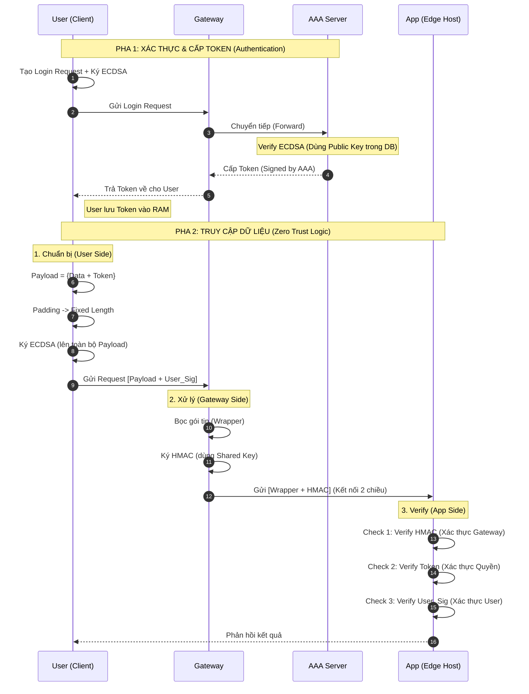

# Đồ án: Kiến trúc Bảo mật Zero Trust với Cơ chế Ký số và Xác thực Đa lớp (Zero Trust & Request Signing Architecture)

## 1\. Tổng quan Dự án (Project Overview)

### 1.1. Vấn đề đặt ra

Trong các mô hình bảo mật truyền thống (Perimeter Security), hệ thống thường chỉ kiểm tra kỹ lưỡng ở lớp Gateway. Khi tin tặc vượt qua được Gateway, chúng có thể tự do tấn công các ứng dụng bên trong (Lateral Movement). Ngoài ra, việc sử dụng Session Token/Cookies truyền thống dễ bị đánh cắp qua các lỗi XSS hoặc Man-in-the-Middle.

### 1.2. Giải pháp đề xuất

Dự án xây dựng một mô hình **Zero Trust (Không tin cậy bất kỳ ai)** áp dụng cho các hệ thống tài chính/ngân hàng hoặc quân sự.
Các đặc điểm cốt lõi:

- **Không tin Gateway tuyệt đối:** Ứng dụng cuối (App) phải tự xác minh lại danh tính người dùng.
- **Không dùng Session Token đơn thuần:** Token bị trộm cũng không dùng được nếu thiếu Private Key (Cơ chế _Holder-of-Key_).
- **Ký số trên mọi request:** Đảm bảo tính chống chối bỏ (Non-repudiation).
- **Chống phân tích lưu lượng:** Sử dụng kỹ thuật Padding để làm phẳng kích thước gói tin.

---

## 2\. Kiến trúc Hệ thống (System Architecture)

Hệ thống được chia thành 3 vùng bảo mật chính: **Client Zone** (Người dùng), **DMZ Zone** (Vùng đệm), và **Internal Zone** (Vùng lõi an toàn).

```mermaid
graph TD
    %% --- STYLE ---
    classDef untrusted fill:#ffebee,stroke:#d32f2f,stroke-width:2px;
    classDef dmz fill:#fff8e1,stroke:#fbc02d,stroke-width:2px;
    classDef internal fill:#e8f5e9,stroke:#2e7d32,stroke-width:2px;

    %% --- 1. CLIENT ZONE ---
    subgraph Client_Zone ["1. Vùng Người Dùng (Client Side)"]
        User((User / App)):::untrusted
        subgraph User_Store [Lưu trữ cục bộ]
            PrivKey["🔑 Private Key (Cố định)"]
            TokenStore["🎫 Access Token (Lưu tạm)"]
        end
        User --- User_Store
    end

    %% --- 2. DMZ ZONE ---
    subgraph DMZ_Zone ["2. DMZ (Gateway & Routing)"]
        LB(Load Balancer):::dmz
        GW(Gateway):::dmz
    end

    %% --- 3. INTERNAL ZONE ---
    subgraph Internal_Zone ["3. Hệ thống Backend (Secure Edge)"]
        AAA(AAA Server):::internal
        App(App / Edge Host):::internal
        DB[(User Public Keys <br/>& Policies)]:::internal
    end

    %% --- FLOW ---
    User_Store -.->|Ký ECDSA| User
    User ==>|Gửi Request| LB
    LB ==>|Forward| GW
    GW <-->|Login & Verify| AAA
    AAA <--> DB
    GW <==>|Request + HMAC (2 chiều)| App

    %% Verify Logic
    App -.->|Verify Token| AAA
    App -.->|Verify User Sig| DB
```

### Các thành phần chính:

1.  **User (Client):**
    - Lưu trữ **Private Key** (Bí mật dài hạn - Long term secret).
    - Thực hiện mã hóa, padding và ký số (ECDSA).
2.  **Gateway:**
    - Điểm kiểm soát ra vào.
    - Xác thực với AAA để xin Token cho User.
    - Đóng gói request và ký **HMAC** trước khi gửi vào mạng nội bộ.
3.  **AAA Server (Authentication, Authorization, Accounting):**
    - Trung tâm tin cậy (Trust Anchor).
    - Quản lý Database chứa **Public Key** của người dùng.
    - Cấp phát Access Token.
4.  **App (Edge Host):**
    - Điểm cuối cùng xử lý nghiệp vụ.
    - Thực hiện xác thực đa lớp (Verify Gateway, Verify Token, Verify User).

---

## 3\. Các cơ chế Bảo mật Trọng yếu (Key Security Mechanisms)

Dự án áp dụng tổ hợp các kỹ thuật sau để đạt mức độ an toàn cao nhất:

### 3.1. Mã hóa Bất đối xứng (Asymmetric Cryptography) - ECDSA

- **Mục đích:** Định danh người dùng và Chống chối bỏ.
- **Cách dùng:** User dùng Private Key để ký lên dữ liệu. Server dùng Public Key để kiểm tra.
- **Tại sao ECDSA?** Nhanh và nhẹ hơn RSA, phù hợp cho thiết bị di động và tần suất request cao.

### 3.2. Mã hóa Đối xứng (Symmetric Cryptography) - HMAC

- **Mục đích:** Bảo vệ tính toàn vẹn trên đường truyền nội bộ (Gateway -\> App).
- **Cách dùng:** Gateway và App chia sẻ một `Shared Secret Key`. Gateway tạo mã HMAC bao bọc gói tin. App kiểm tra mã này để đảm bảo gói tin đến từ Gateway chính chủ.

### 3.3. Cơ chế Proof-of-Possession (Holder-of-Key)

- **Nguyên lý:** Token chỉ là điều kiện _cần_. Chữ ký Private Key là điều kiện _đủ_.
- **Bảo vệ:** Nếu Hacker trộm được Token của User nhưng không có Private Key, Token đó vô hiệu.

### 3.4. Kỹ thuật Padding & Fixed Length

- **Vấn đề:** Hacker có thể đoán loại hành động (Login, Chuyển tiền, Upload) dựa trên kích thước gói tin.
- **Giải pháp:** Mọi gói tin trước khi gửi đều được chèn dữ liệu rác (padding) để đạt độ dài cố định (ví dụ: luôn là 4KB).

---

## 4\. Luồng hoạt động chi tiết (Workflow)

Quy trình được chia làm 2 pha: **Pha 1 (Login)** và **Pha 2 (Giao dịch)**.

### Sơ đồ Tuần tự (Sequence Diagram)



---

## 5\. Đặc tả Gói tin (Data Structure)

Để triển khai (Code), gói tin cần tuân thủ cấu trúc sau:

### 5.1. Gói tin từ User gửi Gateway

Đây là cấu trúc JSON/Binary mà Client tạo ra ở Pha 2:

```json
{
  "meta": {
    "timestamp": 1715241000,
    "version": "1.0"
  },
  "protected_payload": {
    "token": "eyJhbGciOiJ...", // Token nhận được từ Pha 1
    "data": {
      "action": "transfer",
      "amount": 5000000,
      "receiver": "account_b"
    },
    "padding": "0xFA21C... (random bytes)" // Đệm để đủ kích thước cố định
  },
  "user_signature": "<ECDSA_Sign_of_protected_payload>"
}
```

### 5.2. Gói tin từ Gateway gửi App

Gateway bọc gói tin trên và thêm lớp HMAC:

```json
{
  "gateway_envelope": {
    "original_request": { ...User_Packet_Above... },
    "gateway_metadata": {
      "arrival_time": 1715241001,
      "route_id": "route_payment_service"
    }
  },
  "gateway_hmac": "<HMAC_SHA256_of_gateway_envelope>"
}
```

---

## 6\. Kết luận

Mô hình này giải quyết triệt để các lỗ hổng của xác thực truyền thống bằng cách:

1.  **Phân tán niềm tin:** Gateway không còn là điểm tử huyệt duy nhất.
2.  **Bảo vệ dữ liệu:** Dữ liệu được bảo vệ bởi chữ ký số của chính chủ nhân từ đầu đến cuối.
3.  **Tách biệt khóa:** Khóa riêng tư (User), Khóa chia sẻ (Gateway), Khóa công khai (AAA) được quản lý độc lập.
